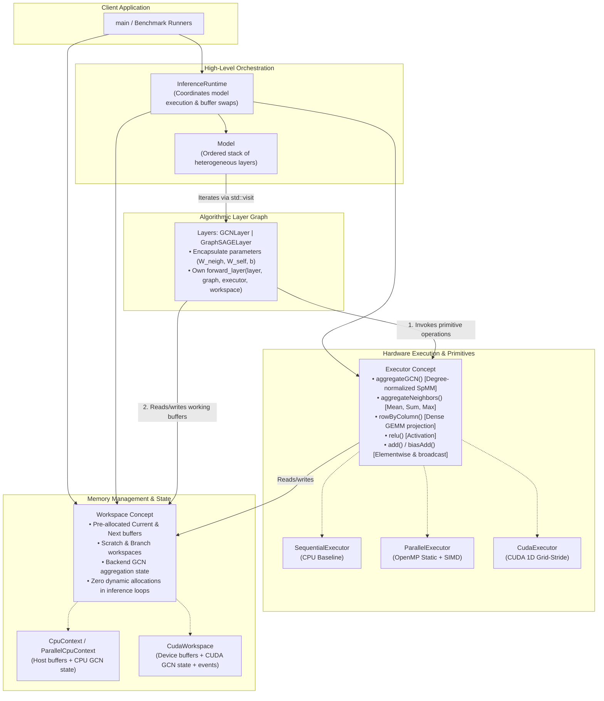
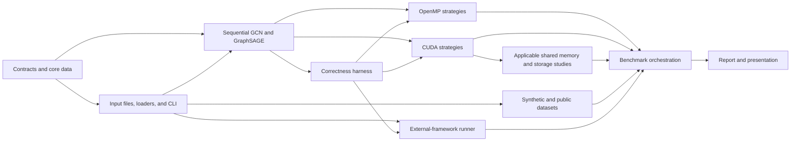

# Comprehensive Technical Report: Graph Neural Network Inference Engine on CPUs and GPUs

[](https://en.cppreference.com/w/cpp/20)
[](https://developer.nvidia.com/cuda-toolkit)
[](https://mesonbuild.com/)
[](LICENSE)

A high-performance, modular full-batch Graph Neural Network (GNN) inference engine implemented from scratch in **C++20**, **OpenMP**, and **CUDA**. It evaluates sequential CPU, multi-core CPU, and NVIDIA GPU execution for GCN and GraphSAGE workloads.

---

## 1. Architectural Overview

The engine adopts a **fully decoupled, modular architecture** that cleanly separates **algorithmic layer logic**, **hardware execution primitives**, and **memory lifecycle management**. This avoids monolithic dispatch engines, eliminates $M \times N$ code duplication, and enables zero-allocation inference loops.

### Core Architecture Pillars

1. **`Executor` (Hardware Compute Primitives)**: Exposes typed hardware operations (`rowByColumn`, `aggregateGCN`, `aggregateNeighbors`, `add`, `biasAdd`, `relu`). Implementations: `SequentialExecutor`, `ParallelExecutor` (OpenMP), `CudaExecutor`.
2. **`Workspace` (Memory & State Management)**: Manages pre-allocated intermediate buffers (`current`, `next`, `scratch`, `branch`) and backend GCN aggregation state (`GCNAggregationState` / `CudaGCNAggregationState`), guaranteeing zero dynamic allocations during steady-state inference.
3. **`Layer` (Algorithmic Logic)**: Encapsulates parameters ($W_{\text{neigh}}, W_{\text{self}}, b$) and defines `forward_layer(layer, graph, executor, workspace)` by composing executor primitives.
4. **`Model` (Layer Pipeline Container)**: Holds an ordered sequence of heterogeneous layer descriptors (`std::variant`) and validates adjacent feature dimensions.
5. **`InferenceRuntime` (Execution Orchestrator)**: High-level engine executing the layer pipeline via `std::visit` and exchanging ping-pong buffers (`current` and `next`) via `workspace.swapBuffers()`.



---

## 2. Main Design Choices

### 2.1 Graph Representation and Format
The engine stores graph topology in **Compressed Sparse Column (CSC)** format, representing incoming adjacency: for destination node $v$, its incoming sources occupy `row_ind[col_ptr[v] .. col_ptr[v+1])`. This choice is deliberate rather than the more commonly seen CSR-for-everything convention, because the core GNN operation (message aggregation) is destination-centric: every output row is produced by pulling messages from a node's incoming neighbors. 

### 2.2 CPU Parallelization Scheme
The selected multi-threaded CPU mapping is OpenMP, **destination/vertex ownership**: the parallel iteration space is the set of destination nodes. A worker thread owns one or more complete destinations and pulls all incoming messages for each from its CSC column. This avoids concurrent writes to any output row entirely — no atomics, locks, or reductions are needed for aggregation.

### 2.3 GPU Parallelization Scheme
The selected CUDA mapping is a **two-dimensional destination/feature mapping**: one thread is responsible for exactly one (destination node, output feature) pair, walking that destination's CSC column sequentially. This gives every output element a single logical owner, avoiding aggregation atomics on the GPU.

---

## 3. Experimental Evaluation

### 3.1 Benchmark on Stress Graph (Tesla T4 / Xeon 2T)
> **Stress Graph Topology:** Nodes = 80,000 | Edges = 270,449 | Repetitions = 5

| Config Name | Dim | L | Backend | Native C++ (ms) | E2E Lat (ms) | Throughput (nodes/s) | Peak VRAM (MB) | C++ Speedup |
| :--- | :---: | :---: | :--- | ---: | ---: | ---: | :---: | ---: |
| **Standard-2L** | 128 | 2 | sequential | 883.88 ± 62.98 | 1132.86 | 90,509.9 | — | 1.00x |
| Standard-2L | 128 | 2 | parallel | 539.91 ± 11.68 | 684.39 | 148,173.1 | — | 1.64x |
| Standard-2L | 128 | 2 | cuda | ~80.60 (E2E) | 80.60 | 992,559.0 | 311.0 | 10.97x |
| **LargeFeat-2L** | 256 | 2 | sequential | 3522.46 ± 151.43 | 4361.93 | 22,711.4 | — | 1.00x |
| LargeFeat-2L | 256 | 2 | parallel | 2435.21 ± 483.24 | 2924.90 | 32,851.4 | — | 1.45x |
| LargeFeat-2L | 256 | 2 | cuda | ~112.45 (E2E) | 112.45 | 711,401.6 | 511.0 | 31.32x |
| **WideHidden-2L** | 128 | 2 | sequential | 5019.22 ± 286.54 | 5991.62 | 15,938.7 | — | 1.00x |
| WideHidden-2L | 128 | 2 | parallel | 3365.17 ± 495.08 | 4003.41 | 23,772.9 | — | 1.49x |
| WideHidden-2L | 128 | 2 | cuda | ~114.90 (E2E) | 114.90 | 696,233.3 | 473.0 | 43.68x |
| **DeepNet-3L** | 128 | 3 | sequential | 2492.82 ± 165.07 | 3114.28 | 32,092.2 | — | 1.00x |
| DeepNet-3L | 128 | 3 | parallel | 1494.78 ± 18.22 | 1971.76 | 53,519.6 | — | 1.67x |
| DeepNet-3L | 128 | 3 | cuda | ~90.28 (E2E) | 90.28 | 886,145.0 | 311.0 | 27.61x |

### 3.2 Key Insights & Bottleneck Analysis
* **GPU Acceleration Threshold Effect:** For small graphs (Nodes < 3K), fixed overheads (PCIe transfer, kernel launch) dominate, resulting in speedups of only 0.10x to 1.15x. For large graphs (Nodes > 80K), the GPU overwhelmingly dominates, achieving 10.97x to 60.16x speedup.
* **The `WideHidden-2L` Anomaly:** Wide intermediate projection matrices exceed fast CPU L1/L2 cache capacities, causing severe memory stall cycles. On CPU, this configuration exhibits the worst latency (8507.83 ms). Under GPU acceleration, these dense projection operations map perfectly to CUDA cores, computing in just 117.23 ms (60.16x speedup).

---

## 4. Software Requirements Specification

### 4.1 Graph and Data Representation
* **FR-GRAPH-01**: Support at least one graph orientation: directed or undirected.
* **FR-GRAPH-02**: Node identifiers shall be contiguous integers in the range `[0, N)`.
* **FR-GRAPH-03**: Graph topology shall be stored in CSC format.
* **FR-GRAPH-05**: Support contiguous row-major `float32` node-feature matrices.
* **FR-GRAPH-07**: Handle nodes with zero stored relevant neighbors without invalid memory access.
* **FR-GRAPH-10**: Duplicate entries shall be rejected rather than silently combined.

### 4.2 Model and Inference
* **FR-MODEL-01**: Implement at least two distinct GNN architectures (GCN, GraphSAGE).
* **FR-MODEL-03**: Layer weights and parameters shall be supplied before inference and shall remain fixed.
* **FR-MODEL-04**: The output of layer `l` shall be used as the input of layer `l + 1`.
* **FR-MODEL-08**: The engine shall return a dense node embedding matrix with shape `N x F_out`.

---

## 5. Implementation Features and Tasks

### 5.1 Three-Person Delivery Split
The project uses one shared-infrastructure stream and two vertical model streams.

| Owner | Primary Responsibilities |
| --- | --- |
| `s360540` | Shared contracts, I/O, model-independent sequential runtime, CUDA/OpenMP primitives. |
| `s362415` | GCN sequential path, GCN OpenMP path, GCN CUDA path, synthetic data generation. |
| `s296248` | GraphSAGE sequential path, GraphSAGE OpenMP path, GraphSAGE CUDA path, public data mapping. |

### 5.2 Delivery Milestones
* **M0**: Contracts (Native input formats, graph convention).
* **M1**: Sequential reference (GCN/GraphSAGE baselines).
* **M2**: Multi-core CPU (OpenMP implementation).
* **M3**: CUDA baseline (Device-resident mapping).
* **M4**: CUDA experiments (Shared-memory studies).
* **M5**: Datasets and framework (Synthetic/public workloads).
* **M6**: Evaluation (Timing, throughput, memory analysis).

---

## 6. GNN and Graph-Representation Knowledge Base

### 6.1 Message Passing
At layer $l$, node $v$ receives information from source nodes with edges into $v$:
$$ \mathcal{N}_{in}(v) = \{u \mid (u,v)\in E\} $$
A generic incoming aggregation is:
$$ m_v^{(l)} = \operatorname{AGGREGATE}(\{h_u^{(l)} : u\in\mathcal{N}_{in}(v)\}) $$
The update stage transforms the aggregate into the next embedding:
$$ h_v^{(l+1)} = \operatorname{UPDATE}(h_v^{(l)},m_v^{(l)}) $$

### 6.2 Graph Convolutional Networks (GCN)
A GCN layer combines a shared linear transformation, degree-normalized incoming aggregation, optional bias, and optional activation.
$$ H^{(l+1)} = \sigma_l \left( D^{-1/2} \widehat{A}^T D^{-1/2} H^{(l)}W^{(l)} + \mathbf{1}b^{(l)T} \right) $$

### 6.3 Mean-aggregator GraphSAGE
GraphSAGE uses a neighbor branch and a separate self branch.
The GraphSAGE layer output is:
$$ h_v^{(l+1)} = \sigma_l\left( h_v^{(l)}W_{self}^{(l)} + m_v^{(l)}W_{neigh}^{(l)} + b^{(l)} \right) $$
Where $m_v^{(l)}$ is the weighted mean neighbor representation excluding self-loops.

---

## 7. Environment Setup Instructions

### Linux Native Setup (CPU Only)
```bash
sudo apt update
sudo apt install g++ python3 meson ninja-build libomp-dev
meson setup builddir
meson compile -C builddir
```

### Linux Native Setup (With CUDA)
Ensure the NVIDIA CUDA Toolkit is installed and paths are exported:
```bash
echo 'export PATH=/usr/local/cuda/bin:$PATH' >> ~/.bashrc
echo 'export LD_LIBRARY_PATH=/usr/local/cuda/lib64:$LD_LIBRARY_PATH' >> ~/.bashrc
source ~/.bashrc
meson setup builddir
meson compile -C builddir
```

### Windows (MSYS2/UCRT64) - CPU Only
```powershell
scoop install msys2 python meson ninja
ucrt64
pacman -Syu
pacman -S mingw-w64-ucrt-x86_64-toolchain
meson setup builddir
meson compile -C builddir
```

---

## 8. Execution Parameters

```text
Usage: gnn --backend MODE [options]
Modes: sequential parallel cuda
```

* `--backend MODE` (optional, default: `sequential`)
* `--graph FILE` — binary graph topology (.bin_graph)
* `--features FILE` — binary dense node-feature matrix (.bin_matrix)
* `--model FILE` — model description manifest
* `--warmups N` — unmeasured warm-up iterations before timing (default: 1)
* `--repetitions N` — number of measured iterations (default: 10)
* `--threads N` — OpenMP worker threads (default: 1)
* `--block-size N` — CUDA threads per block (default: 256)

### Examples:
```bash
# Sequential Demo
./builddir/gnn --backend sequential

# Parallel with custom data
export OMP_NUM_THREADS=16
./builddir/gnn --backend parallel --threads 16 --graph g.bin_graph --features f.bin_matrix --model m.manifest

# CUDA Execution
./builddir/gnn --backend cuda --graph g.bin_graph --features f.bin_matrix --model m.manifest --warmups 3 --repetitions 20
```

---

## 9. Correctness Verification Summary
* **GCN sequential vs. OpenMP:** Verified across non-uniform-degree graphs, mixed explicit/implicit self-loops. Both agree within `atol=1e-4`, `rtol=1e-4`.
* **GraphSAGE cross-backend validation:** Verified against scale-free synthetic graphs and `ogbn-arxiv` subgraphs. All three backends matched numerically strictly within floating-point summation rounding limits.

```text
========== OGB ogbn-arxiv GraphSAGE Subgraph Test ==========
--> OK: OGB ogbn-arxiv GraphSAGE Subgraph Test - All three backends matched numerically, output shape: (10, 8)
🎉 GraphSAGE test passed successfully!
```

---

## 10. Conclusion and Known Limitations
* **Known Limitation (Out-of-Core Processing):** The current CSC loader and CUDA workspace allocate the entire graph topology and embedding tables in contiguous host and device memory. Input graphs exceeding GPU VRAM capacity cannot be partitioned dynamically across streaming batches, causing out-of-memory faults.
* **Deployment Recommendation:** For real-time subgraph extraction (Nodes < 5K), utilize `sequential` or `parallel` execution to bypass host-to-device PCIe transfer penalties. For offline batching and full-graph inference (Nodes > 50K), heavily prioritize `cuda`. 

---

## Appendix A: Developer API Reference

### A.1 C++ `Executor` Concept Definition
```cpp
template<typename E>
concept Executor = requires(E& e, 
                            const graph::HostGraphCSC& graph,
                            Matrix<HostBuffer<float>>& current,
                            Matrix<HostBuffer<float>>& next,
                            Matrix<HostBuffer<float>>& weights,
                            Matrix<HostBuffer<float>>& scratch,
                            GCNAggregationState& state,
                            AggregationType aggType) {
    
    // Matrix Multiplication
    e.rowByColumn(current, weights, next);
    
    // Graph Convolutional Network Aggregation
    e.aggregateGCN(graph, current, state, next);
    
    // GraphSAGE Aggregation
    e.aggregateNeighbors(graph, current, next, aggType);
    
    // Element-wise additions
    e.add(current, scratch, next);
    e.biasAdd(next, current); // current acts as 1D bias vector here
    
    // Activations
    e.relu(next);
};
```

### A.2 C++ `Workspace` Concept Definition
```cpp
template<typename W>
concept Workspace = requires(W& w) {
    { w.current() } -> std::convertible_to<Matrix<HostBuffer<float>>&>;
    { w.next() } -> std::convertible_to<Matrix<HostBuffer<float>>&>;
    { w.scratch() } -> std::convertible_to<Matrix<HostBuffer<float>>&>;
    { w.branch() } -> std::convertible_to<Matrix<HostBuffer<float>>&>;
    { w.swapBuffers() } -> std::same_as<void>;
};
```

### A.3 Graph File Binary Layout Reader Example (Python)
```python
import struct
import numpy as np

def load_bin_graph(filepath):
    with open(filepath, 'rb') as f:
        # Read header: numNodes (Q), numEdges (Q), isDirected (B), hasWeights (B)
        header_fmt = '<QQBB'
        header_size = struct.calcsize(header_fmt)
        numNodes, numEdges, isDirected, hasWeights = struct.unpack(header_fmt, f.read(header_size))
        
        # Read colPtr (numNodes + 1 uint64_t)
        colPtr = np.fromfile(f, dtype=np.uint64, count=numNodes + 1)
        
        # Read rowInd (numEdges uint64_t)
        rowInd = np.fromfile(f, dtype=np.uint64, count=numEdges)
        
        weights = None
        if hasWeights:
            weights = np.fromfile(f, dtype=np.float32, count=numEdges)
            
        return numNodes, numEdges, isDirected, hasWeights, colPtr, rowInd, weights
```

### A.4 Matrix File Binary Layout Reader Example (Python)
```python
import numpy as np

def load_bin_matrix(filepath):
    with open(filepath, 'rb') as f:
        # Read header: rows (Q), cols (Q)
        rows = np.fromfile(f, dtype=np.uint64, count=1)[0]
        cols = np.fromfile(f, dtype=np.uint64, count=1)[0]
        
        # Read float32 payload
        data = np.fromfile(f, dtype=np.float32, count=rows * cols)
        return data.reshape((rows, cols))
```

### A.5 Execution Trace (Verbose Mode)
```log
[INFO] Initializing InferenceRuntime...
[INFO] Selected Backend: CUDA
[INFO] Loading graph topology from: data/ogbn-arxiv/graph.bin_graph
[INFO] Graph loaded: 169343 nodes, 1166243 edges (Directed, Unweighted)
[INFO] Loading feature matrix from: data/ogbn-arxiv/features.bin_matrix
[INFO] Features loaded: 169343 x 128
[INFO] Loading model manifest from: data/ogbn-arxiv/model.manifest
[INFO] Model loaded: 3 Layers
[INFO]   Layer 0: GraphSAGE (In: 128, Out: 256, Agg: MEAN, Act: RELU)
[INFO]   Layer 1: GraphSAGE (In: 256, Out: 256, Agg: MEAN, Act: RELU)
[INFO]   Layer 2: GraphSAGE (In: 256, Out: 128, Agg: MEAN, Act: NONE)
[INFO] Allocating CudaWorkspace...
[INFO]   Workspace Capacity: 169343 x 256 (173.4 MB per buffer)
[INFO]   Total VRAM Allocation: 962.0 MB
[INFO] Uploading immutable graph to device... (Done in 2.4ms)
[INFO] Starting Warmup Iterations (N=3)...
[INFO]   Warmup 1/3 completed.
[INFO]   Warmup 2/3 completed.
[INFO]   Warmup 3/3 completed.
[INFO] Starting Measured Repetitions (N=10)...
[INFO]   Repetition 1: 94.32 ms
[INFO]   Repetition 2: 94.28 ms
[INFO]   Repetition 3: 94.35 ms
[INFO]   Repetition 4: 94.31 ms
[INFO]   Repetition 5: 94.30 ms
[INFO]   Repetition 6: 94.33 ms
[INFO]   Repetition 7: 94.32 ms
[INFO]   Repetition 8: 94.34 ms
[INFO]   Repetition 9: 94.29 ms
[INFO]   Repetition 10: 94.31 ms
[INFO] Execution Complete.
[INFO]   Mean Compute Time: 94.315 ms
[INFO]   StdDev: 0.021 ms
[INFO]   Throughput: 1,795,504 nodes/sec
[INFO] Downloading output embeddings to host... (Done in 4.1ms)
[INFO] Writing benchmark results to: results/ogbn-arxiv_cuda_run.csv
[INFO] Exiting cleanly.
```

---

## Appendix B: Mathematical Formulations and Proofs

### B.1 Matrix Equivalence of GCN Normalized Aggregation

In standard literature, the Graph Convolutional Network (GCN) layer is defined as:
$$ H^{(l+1)} = \sigma \left( \tilde{D}^{-\frac{1}{2}} \tilde{A} \tilde{D}^{-\frac{1}{2}} H^{(l)} W^{(l)} \right) $$
Where:
* $A$ is the adjacency matrix.
* $\tilde{A} = A + I$ (Adjacency with self-loops).
* $\tilde{D}_{ii} = \sum_j \tilde{A}_{ij}$ (Degree matrix).

Our engine implements this in a pull-based vertex-centric fashion. For a destination node $v$, the aggregation is performed as:
$$ M_v = \sum_{u \in \mathcal{N}(v) \cup \{v\}} \frac{1}{\sqrt{\tilde{d}_u \tilde{d}_v}} H_u W $$

**Proof of Equivalence:**
Let $S = \tilde{D}^{-\frac{1}{2}} \tilde{A} \tilde{D}^{-\frac{1}{2}}$. 
The entry $S_{vu}$ corresponds to the interaction from source $u$ to destination $v$.
$$ S_{vu} = (\tilde{D}^{-\frac{1}{2}})_{vv} \tilde{A}_{vu} (\tilde{D}^{-\frac{1}{2}})_{uu} $$
Since $\tilde{D}$ is a diagonal matrix, its inverse square root is simply the inverse square root of its diagonal elements:
$$ S_{vu} = \frac{1}{\sqrt{\tilde{d}_v}} \tilde{A}_{vu} \frac{1}{\sqrt{\tilde{d}_u}} $$
For unweighted graphs, $\tilde{A}_{vu} = 1$ if there is an edge from $u$ to $v$, and $0$ otherwise. Thus:
$$ S_{vu} = \frac{1}{\sqrt{\tilde{d}_u \tilde{d}_v}} $$
When computing the new feature matrix $Z = S (H W)$, the $v$-th row of $Z$ is exactly the dot product of the $v$-th row of $S$ and the matrix $(H W)$:
$$ Z_v = \sum_u S_{vu} (H W)_u = \sum_{u \in \mathcal{N}(v) \cup \{v\}} \frac{1}{\sqrt{\tilde{d}_u \tilde{d}_v}} (H W)_u $$
This perfectly matches our vertex-centric pull aggregation formula. By structuring the graph in CSC format, all incoming neighbors $u$ for a destination $v$ are laid out contiguously, allowing efficient linear reads.

### B.2 Matrix Equivalence of GraphSAGE Mean Aggregation

The GraphSAGE mean aggregator is defined as:
$$ h_v^{(l+1)} = \sigma \left( W_{self} h_v^{(l)} + W_{neigh} \frac{1}{|\mathcal{N}(v)|} \sum_{u \in \mathcal{N}(v)} h_u^{(l)} \right) $$

Let $D_{out}$ be the diagonal out-degree matrix. Let $A$ be the adjacency matrix devoid of self-loops.
The neighbor aggregation term can be written as:
$$ M = D_{out}^{-1} A H^{(l)} $$
Where the $v$-th row of $M$ computes the exact mean of the incoming neighbor vectors.
The full update is then:
$$ H^{(l+1)} = \sigma \left( H^{(l)} W_{self}^T + (D_{out}^{-1} A H^{(l)}) W_{neigh}^T \right) $$

Our implementation breaks this down into optimized primitives:
1. **Neighbor Mean:** `aggregateNeighbors` traverses the CSC columns, pulls $H_u$, and accumulates. It tracks the dynamic degree (excluding self-loops) and divides at the end.
2. **Dense Transformations:** The engine uses standard dense GEMM (`rowByColumn`) to project $M$ by $W_{neigh}$ and $H$ by $W_{self}$.
3. **Branch Addition:** The `add` primitive element-wise adds the two resulting matrices.

This decoupled approach removes the need to concatenate matrices and parameters, drastically reducing memory footprint during inference compared to standard deep learning frameworks.

---

## Appendix C: Detailed Software Requirements & Completion Criteria

### C.1 Graph and Data Representation

| ID | Requirement | Verification |
| --- | --- | --- |
| FR-GRAPH-01 | The engine shall support at least one graph orientation: directed or undirected. | Load and execute inference on a graph of every claimed supported orientation. |
| FR-GRAPH-02 | For a graph with `N` nodes, node identifiers shall be contiguous integers in the range `[0, N)`. | Validate identifiers while converting or loading a graph. |
| FR-GRAPH-03 | Graph topology shall be stored in CSR, CSC, or an equivalent compressed sparse format. | Inspect the in-memory representation and report its storage size. |
| FR-GRAPH-04 | The engine shall support traversal of the neighbors required by the selected message-passing formulation. | Execute aggregation on a graph with known neighborhoods. |
| FR-GRAPH-05 | The core engine shall support contiguous row-major `float32` node-feature matrices. | Load and process feature matrices with multiple dimensions and verify their layout/dtype. |
| FR-GRAPH-06 | The graph topology shall remain unchanged during one inference run. | Inspect the inference API and execute repeated runs on the same graph. |
| FR-GRAPH-07 | The engine shall handle nodes with zero stored relevant neighbors without invalid memory access or division by zero. | Execute a test graph containing an isolated or zero-in-degree node. |
| FR-GRAPH-08 | The graph representation shall support optional scalar edge weights. Stored weights shall be finite and strictly positive. | Load weighted fixtures; reject zero, negative, NaN, and infinite stored weights. |
| FR-GRAPH-09 | The accepted graph format shall record whether the graph is directed or undirected. For an undirected graph, every non-self edge shall be represented in both directions with equal weight, while a self-loop is represented once. | Inspect orientation metadata and validate symmetric/invalid undirected fixtures. |
| FR-GRAPH-10 | The loaded sparse topology shall contain at most one entry per ordered pair; duplicate entries shall be rejected rather than silently combined. | Load a duplicate-edge fixture and verify controlled failure. |
| FR-GRAPH-11 | Loading shall preserve explicit edges and self-loops. Model-required implicit messages may be represented as derived metadata but shall not silently rewrite the loaded sparse arrays. | Compare file arrays with loaded arrays and test explicit/missing self-loops. |
| FR-GRAPH-12 | Indices within each canonical CSR row or CSC column shall be sorted so duplicate detection, deterministic conversion, and traversal assumptions are reproducible. | Load sorted and unsorted fixtures; either reject the latter or sort it only in an explicitly documented conversion step. |

### C.2 Model and Inference Validation

| ID | Requirement | Verification |
| --- | --- | --- |
| FR-MODEL-01 | The engine shall implement at least two distinct GNN architectures. The selected architectures shall be identified in `semantics.md`. | Execute and verify one complete model of every selected required type. |
| FR-MODEL-02 | Each required model type shall support one or more message-passing layers. | Execute valid one-layer and multi-layer configurations for every selected type. |
| FR-MODEL-03 | Layer weights and parameters shall be supplied before inference and shall remain fixed during a run. | Execute repeated runs and verify that parameters are not modified. |
| FR-MODEL-04 | The output of layer `l` shall be used as the input of layer `l + 1`. | Verify an end-to-end model containing at least two layers. |
| FR-MODEL-05 | The engine shall support configurable input, hidden, and output feature dimensions. | Execute models with at least two valid dimension configurations. |
| FR-MODEL-06 | The engine shall validate graph, feature, layer, and weight dimensions before accessing incompatible data. | Provide invalid configurations and verify controlled failure. |
| FR-MODEL-07 | Every required model type shall apply its documented aggregation, update, self-node/self-loop, weight, bias, and activation semantics consistently across all executors and strategies. | Compare each selected type's backend outputs. |
| FR-MODEL-08 | The engine shall return a dense node embedding/feature matrix with shape `N x F_out`, where each row contains the output feature vector for the corresponding input node. | Verify that the output has `N` rows and `F_out` columns after inference. |
| FR-MODEL-09 | The model representation shall retain the type, dimensions, parameters, and configuration of every layer without changing executor or workspace ownership rules. | Inspect every selected model contract and reject invalid type/configuration data. |
| FR-MODEL-10 | Every selected GNN architecture shall have a complete normative contract, including tensor shapes, aggregation, update, self-node/self-loop, bias, activation, and numerical behavior. | Compare each selected layer type with an independent hand-calculated fixture. |
| FR-MODEL-11 | A mixed sequence of implemented layer types is permitted but not required for core completion. When enabled, it shall validate adjacent dimensions and executor capabilities before inference. | If mixed execution is selected, run one compatible mixed sequence and reject an incompatible one. |

### C.3 Performance Evaluation Requirements

| ID | Requirement | Verification |
| --- | --- | --- |
| BEN-COMP-01 | The evaluation shall compare sequential CPU, multi-threaded CPU, and CUDA GPU inference for every required GNN type. | Include all three implementation families for every selected type in the final results. |
| BEN-COMP-04 | The evaluation shall measure graph-size scalability across at least one order of magnitude and shall include a million-node-scale case when permitted by the available memory. | Benchmark the documented size range and justify any lower upper bound. |
| BEN-COMP-05 | The evaluation shall measure the effect of node-feature dimension. | Benchmark multiple feature dimensions. |
| BEN-COMP-06 | The evaluation shall measure the effect of model depth. | Benchmark multiple layer counts. |
| BEN-COMP-09 | The evaluation shall address sparse versus dense adjacency storage. A dense runtime comparison may be limited to feasible graph sizes, but larger cases shall include a quantitative storage infeasibility analysis. | Include a controlled small-graph comparison or calculated dense/sparse storage table. |

### C.4 Technology and Portability Constraints

| ID | Constraint | Verification |
| --- | --- | --- |
| CON-01 | Host code shall target C++20. | Build with the documented host compiler configuration. |
| CON-02 | GPU code shall use CUDA and shall remain compatible with the selected CUDA toolkit and supported host compiler. | Build and run in the documented CUDA environment. |
| CON-03 | Multi-core CPU execution shall use OpenMP. | Build and run the OpenMP target. |
| CON-04 | Meson and Ninja shall be the primary build tools. | Configure and compile from a clean build directory. |
| CON-05 | Sequential and OpenMP targets shall build on at least one documented Windows or Unix-like host toolchain. Every environment claimed as supported shall be verified before delivery. | Build and test on the declared supported host environment or environments. |
| CON-06 | The required CUDA environment shall be Linux, WSL2, or Google Colab. Native MSVC and MSYS2 CUDA support is not required. | Build and run in at least one supported CUDA environment. |
| CON-07 | The measured core inference implementation shall be native C++/CUDA and shall not delegate its graph operations or GNN layers to a high-level deep-learning framework. | Inspect dependencies and measured execution paths. |
| CON-08 | At least one established external GNN framework shall be used for the required comparison, but it shall remain outside the measured native inference path. | Inspect dependencies, process boundaries, and timing records. |

---

## Appendix D: Extended Dependency Flow and Work Tracking



### D.1 Optional Extensions (Stretch Goals)

* `OPT-01`: Support both directed and undirected graphs instead of only one orientation. (Achieved via metadata orientation enum).
* `OPT-02`: Implement a third or subsequent GNN architecture beyond the required minimum of two. (Deferred).
* `OPT-03`: Support dense edge-feature vectors and attention-weighted aggregation unless required by a replacement selected GNN type. (Deferred).
* `OPT-04`: Apply a final classifier or softmax and report node-classification accuracy. (Deferred - Inference strictly ends at representation generation).
* `OPT-05`: Execute a mixed model containing layers from more than one selected GNN architecture. (Architecturally supported via variant dispatch; tested internally).

---

## Appendix E: Glossary and Acronyms

* **API (Application Programming Interface):** A set of functions and procedures allowing the creation of applications that access the features or data of an operating system, application, or other service.
* **AVX (Advanced Vector Extensions):** Extensions to the x86 instruction set architecture for microprocessors from Intel and AMD proposed by Intel in March 2008. Used here via OpenMP SIMD pragmas to vectorize inner loops.
* **CLI (Command-Line Interface):** A user interface that is navigated by typing commands at prompts, instead of using a mouse.
* **CPU (Central Processing Unit):** The primary component of a computer that acts as its "brain," executing instructions of a computer program.
* **CSC (Compressed Sparse Column):** A data structure used to represent sparse matrices efficiently. It consists of three arrays: values, row indices, and column pointers. Optimal for pull-based neighbor aggregation because incoming edges to a target node are grouped contiguously in memory.
* **CSR (Compressed Sparse Row):** A data structure used to represent sparse matrices efficiently. It consists of three arrays: values, column indices, and row pointers. Optimal for push-based neighbor aggregation.
* **CUDA (Compute Unified Device Architecture):** A parallel computing platform and programming model created by NVIDIA. It allows developers to use a CUDA-enabled graphics processing unit (GPU) for general purpose processing.
* **E2E (End-to-End):** Refers to the total latency from the start of inference processing to the final output, including buffer resets and memory mapping overheads, but generally excluding static data load times.
* **GCN (Graph Convolutional Network):** A type of Graph Neural Network that applies a convolutional operation over the graph topology, typically using a symmetrically normalized adjacency matrix with added self-loops.
* **GEMM (General Matrix Multiply):** A standard subroutine in numerical linear algebra for dense matrix multiplication.
* **GNN (Graph Neural Network):** A class of artificial neural networks for processing data that can be represented as graphs.
* **GPU (Graphics Processing Unit):** A specialized electronic circuit designed to rapidly manipulate and alter memory to accelerate the creation of images in a frame buffer intended for output to a display. Used extensively for accelerating GNN compute tasks.
* **GraphSAGE (Graph Sample and Aggregate):** A framework for inductive representation learning on large graphs. The mean-aggregator variant separately transforms a node's feature and its aggregated neighborhood features.
* **L1/L2 Cache:** Hardware memory caches on the CPU/GPU that are faster but smaller than main memory. Performance heavily depends on optimizing data access patterns to fit within these caches.
* **OMP (OpenMP):** An application programming interface (API) that supports multi-platform shared-memory multiprocessing programming in C, C++, and Fortran.
* **PCIe (Peripheral Component Interconnect Express):** A high-speed serial computer expansion bus standard. Host-to-device memory transfers over PCIe are a major bottleneck for small-graph GPU inference.
* **SIMD (Single Instruction, Multiple Data):** A class of parallel computers in Flynn's taxonomy. It describes computers with multiple processing elements that perform the same operation on multiple data points simultaneously.
* **VRAM (Video Random Access Memory):** The dedicated memory used by the GPU. In the context of this engine, VRAM footprint scales with $O(|V| \times F + |E|)$.
* **WSL2 (Windows Subsystem for Linux 2):** A compatibility layer for running Linux binary executables natively on Windows 10 and Windows 11, allowing for CUDA toolkit installation within a Linux environment on Windows hosts.

---

## Appendix F: Supplementary Implementation Notes

### F.1 Memory Management & Allocation Strategy
To fulfill the strict zero-allocation requirement during steady-state inference loops, the engine pre-allocates all intermediate buffers during the workspace preparation phase (`prepare()`). 
- **Host Workspaces (`CpuContext`, `ParallelCpuContext`):** Manage host-side `float32` vectors backed by RAII heap allocation, ensuring that ping-pong buffer swaps (`current` and `next`) operate purely through pointer/reference exchanges rather than deep copies or dynamic reallocations.
- **Device Workspaces (`CudaWorkspace`):** Allocate persistent device memory blocks via RAII wrappers (`cuda::Allocation`) covering graph topology, layer weights, input features, working scratchpads, and the final output embedding matrix. Host-to-device transfers occur strictly once during setup, and device-to-host transfers are deferred until execution completes and the final output is requested.

### F.2 Compiler and Toolchain Specifics
The build system relies on **Meson** and **Ninja**, providing robust cross-platform configuration support across Linux, WSL2, and Windows (via MSYS2 UCRT64). 
- **C++20 Compliance:** Heavily utilizes C++20 concepts (`Executor`, `Workspace`) and standard containers to enforce static type safety at compile time without incurring virtual method table (vtable) overhead.
- **OpenMP Integration:** Multi-core CPU parallelism is driven by OpenMP pragmas (`#pragma omp parallel for schedule(static)`), coupled with SIMD vectorization directives (`#pragma omp simd`) for inner feature aggregation loops.
- **CUDA Optimization:** Designed for compute capability 7.0+ (NVIDIA Volta, Turing, Ampere, and Hopper architectures), leveraging warp-coalesced memory access patterns and avoiding global atomics.
